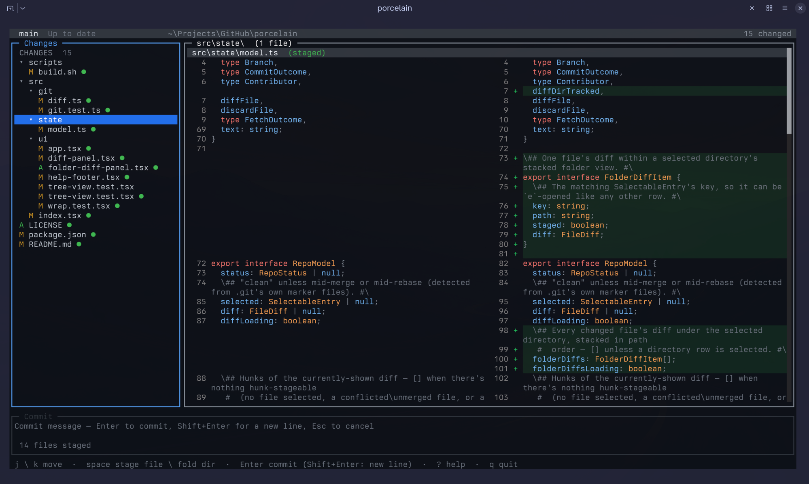

# porcelain

A fast, polished terminal Git client, built with [OpenTUI](https://opentui.com).
The part of GitHub Desktop worth missing — seeing your changes clearly and
committing them without second-guessing — blended with a lazygit-style,
stay-on-the-keyboard workflow, in a TUI that never leaves your terminal.

The name is a pun: `git status --porcelain` is the stable, machine-readable
output format this app parses under the hood — no Git library, just the real
`git` binary, shelled out to and parsed, the same approach [lazygit](https://github.com/jesseduffield/lazygit) takes.



## Why I made this

I liked [GitHub Desktop](https://github.com/desktop/desktop) a lot — but I live in a terminal editor (btw), and switching
out to a GUI to look at a diff or write a commit always broke my flow.
[lazygit](https://github.com/jesseduffield/lazygit) is genuinely great and
solves that, but it's built around its own set of habits and workflows, and I
wanted something shaped around how _I_ actually work day to day. So: porcelain
is my attempt at bringing what I liked about GitHub Desktop — the clarity of
its diff view, the low-stakes feel of staging and committing — into a TUI,
built to fit my own use cases first. Full credit to both projects for the
inspiration.

## Features

- **Status as a folder tree** — collapsible directories, staged/unstaged
  sections, live-updated as files change on disk
- **Side-by-side diffs** (old left / new right, or unified) with syntax
  highlighting, line numbers, and word wrap toggles
- **Hunk-level staging** — stage or unstage a single hunk out of a file, not
  just the whole thing
- **Commit** (with co-authors, amend, and squash), **push / pull / fetch**
  (including `--force-with-lease`)
- **Branches** — switch, create, delete, and merge, with remote-tracking
  branches shown alongside locals (checking one out creates its local branch
  automatically, same as `git switch <name>`'s own DWIM behavior)
- **Stash** — push, pop, apply, drop
- **Conflict handling** — a persistent banner appears the moment a merge or
  rebase pauses on conflicts; resolve files with your own `$EDITOR`, stage
  them, then continue or abort right from the keyboard
- **Undo via reflog** — browse recent HEAD movements and soft-reset back to
  any of them, so nothing is ever truly unrecoverable
- **`gh` integration** — open the current repo on GitHub with one key
  (no-op, not a crash, if `gh` isn't installed or authenticated)

Syntax highlighting covers **ts / tsx / js / jsx / markdown** (the grammars
OpenTUI bundles). Other languages render plain until a tree-sitter parser is
registered for them — see `src/ui/syntax.ts`.

## Install

**Requires [Bun](https://bun.sh).**

```bash
git clone https://github.com/dsdannynikravesh/porcelain.git
bun add --global file:./porcelain
```

That installs both the `porcelain` and `por` commands. If your shell can't
find them afterward, Bun's global bin folder isn't on your `$PATH` yet — add
it (Bun prints the exact line to add, typically `~/.bun/bin`).

From then on, run `porcelain` (or the shorter `por`) from inside any git repo.

Prefer not to install anything? Run it straight from a clone without
installing:

```bash
cd porcelain && bun install && bun start
```

### Standalone binary

No Bun required to _run_ it — only to build it. This compiles a single
self-contained executable for your current OS/arch:

```bash
bun run build      # writes dist/porcelain-<host-os>-<arch>
```

Move the result onto your `$PATH` (e.g. `/usr/local/bin/porcelain`), and
optionally symlink `por` alongside it:

```bash
sudo mv dist/porcelain-* /usr/local/bin/porcelain
sudo ln -s /usr/local/bin/porcelain /usr/local/bin/por
```

`bun run build` compiles for the **host platform only** — OpenTUI's Zig
renderer is a per-platform native package and only the host's is installed.
To ship binaries for multiple platforms, run this same command from a CI
matrix (e.g. macos-latest + ubuntu-latest) and collect the artifacts, or
publish them as GitHub Release assets.

## Keys

| Key       | Action                                               |
| --------- | ---------------------------------------------------- |
| `j` / `k` | move selection                                       |
| `space`   | stage/unstage a file · fold/unfold a directory       |
| `h` / `l` | collapse / expand the selected directory             |
| `a` / `A` | stage all / unstage all                              |
| `c`       | jump to the commit message                           |
| `C`       | pick co-authors (before writing the message)         |
| `Enter`   | commit (`Shift+Enter` for a new line)                |
| `M`       | amend the last commit                                |
| `p` / `P` | pull / push                                          |
| `F`       | force push (`--force-with-lease`)                    |
| `e`       | open the selected file in `$VISUAL`/`$EDITOR`        |
| `X`       | discard the file's changes                           |
| `d` / `u` | scroll the diff                                      |
| `[` / `]` | previous / next hunk                                 |
| `H`       | stage / unstage just the selected hunk               |
| `v`       | toggle split / unified diff                          |
| `w`       | toggle line wrapping in the diff                     |
| `n`       | toggle diff line numbers                             |
| `r`       | refresh                                              |
| `t`       | toggle the commit history view                       |
| `b`       | switch / create / merge / delete a branch            |
| `s`       | stash (push / pop / apply / drop)                    |
| `S`       | squash commits (history view)                        |
| `o`       | open this repo on GitHub                             |
| `z`       | undo — browse the reflog and reset back to any point |
| `g` / `G` | continue / abort a paused merge or rebase            |
| `?`       | help                                                 |
| `q`       | quit                                                 |

The working tree is watched, so external changes (editor saves, other git
commands, a rebase progressing) refresh the view automatically.

## Layout

```
src/
  index.tsx        entry — resolves the repo root, mounts <App/>
  git/             thin async wrappers around the system `git` binary
    exec.ts          runGit(); repo-root resolution
    status.ts        porcelain-v2 parser -> RepoStatus
    diff.ts          unified diff per file (+ untracked synthesis)
    hunk.ts          parse/stage/unstage a single hunk via `git apply`
    stage.ts         add / restore / discard
    commit.ts        commit / amend / staged-check
    branches.ts      list (local + remote) / switch / create / delete / merge
    stash.ts         push / pop / apply / drop
    reflog.ts        undo history
    repostate.ts      merge/rebase-in-progress detection + continue/abort
    push.ts, pull.ts, fetch.ts, log.ts, squash.ts, contributors.ts
  gh/              thin wrapper around the `gh` CLI (repo browse)
  state/
    model.ts         useRepoModel() — single source of repo truth
    history.ts        commit history + per-commit file diffs
    watch.ts          debounced fs watch -> refresh
    tree.ts           folder-tree row building
  ui/                OpenTUI React components (App, StatusPanel, DiffPanel,
                      BranchPicker, StashPicker, ReflogPicker, ConflictBanner, …)
```

`git/` never uses a Git library — it shells out to `git` and parses porcelain
output, so every operation has full fidelity with the real thing.

## Tests

```bash
bun test           # git layer, against throwaway repos
bun run typecheck
bun run lint
```

## License

[MIT](./LICENSE)
